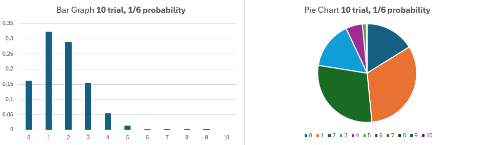

# Binomial Distributions

## Part 1: What is a binomial distribution?

A **binomial distribution** models the number of successes in a fixed number of independent trials, where each trial has the same probability of success.

A binomial distribution problem is described as 
- Having a set of trials **T**, 
- The probability **P** of success for each trial, 
- Success **S**. 
Often we add one more true or false parameter **C** for cumulative, which we will review later.

**What are the chances I get at least one heads if I flip a coin once?**

This problem is described below:

| Input | Value |
|--------|-------|
| T  (trials)    | 1     |
| P  (probability)    | 0.5   |
| S  (successes)    | 1     |

**T** is trials: in this case we are doing one flip. **P** is probability of success: in this case the chances a coin lands heads is 50%.  **S** is success: in this case, we care about the chance of 1 successful trial.

Below BD represents the result of the binomial distribution, which is .5 probability.  That is there is a .5 probability for the problem for 1 **S** success, if we do 1 **T** trial and the chance of a **S** success is 50%.

| Output | Value |
|--------|-------|
| | |
| BD      | .5   |

**What are the chances I get at least two heads if I flip a coin twice?**

| Input | Value |
|--------|-------|
| T      | 2     |
| P      | 0.5   |
| S      | 2     |
| | |
| BD      | .25   |

Intuitively we calculate the chance that the success for one trial is 50%, so the combined chance of two successful trials 25%. 

**What is binomial *probability* distribution (BPD) of two coin flips?**

What I refer to as binomial *probability* distribution is more precisely called the *binomial probability mass function.* Below our first table expresses that **T** trials and **P** probability per trial values are constant; the second tables has a row of success and the probability of that outcome

| Input | Value |
|--------|-------|
| T      | 2     |
| P      | 0.5   |

|BPD| | | |
|:-:|:-:|:-:|:-:|
S | 0  | 1  | 2  |
BD | .25 | .5  | .25 |

That table above says 0 success has 25%, 1 success has 50% and 2 success has 25%.

Again, we can intuitively calculate the table above by expanding all possibilities and recognizing that *Head & Tails* and *Tails & Heads* have the same amount of success and can be combined:

| Outcome | Successes | Probability |
|--------|-------| -------|
| Head & Heads   | S = 0 | .25     |
| Head & Tails   | S = 1 | .25     |
| Tails & Heads  | S = 1 | .25    |
| Tails & Tails  | S = 2 | .25     |

Becomes

| Outcome | Successes | Probability |
|--------|-------| -------|
| Head & Heads   | S = 0 | .25     |
| Head & Tails OR Tails & Heads    | S = 1 | .50     |
| Tails & Tails  | S = 2 | .25     |

Let us do one more simple example, but a problem that is probably too difficult for us to do in our head. What is the BPD, the *Binomial Probability Distribution*, for a student guessing on each question for a true or false test with ten questions (assuming each guess is a 50/50 chance).

| Input | Value |
|--------|-------|
| T      | 10    |
| P      | 0.5   |

|BPD| | | | | | | | | | | | 
|:-:|:-:|:-:|:-:|:-:|:-:|:-:|:-:|:-:|:-:|:-:|:-:|
S | 0  | 1  | 2  | 3 | 4 | 5 | 6 | 7 | 8 | 9 | 10
BD | 0.10% | 0.98% | 4.39% | 11.72% | 20.51% | 24.61% | 20.51% | 11.72% | 4.39% | 0.98% | 0.10%

The students has about a 20% chance of getting 6 out of 10 right and about a 4% chance of getting 8 out of 10 right.  Note that all the percentages, that is all the possible outcomes, should add up to 100% (often when adding rounded numbers the total is not exactly 100%).

`0.10% + 0.98% + 4.39% + 11.72% + 20.51% + 24.61% + 20.51% + 11.72% +  4.39% + 0.98% + 0.10% = 100%`


**What is a Cumulative Distribution Function?**

The next question might be what are the chances of getting *at least* at least 6 out of 10 right or getting 8 out of 10 for the above true / false exam?

**Your intuition is correct.**  Getting at least 8 right is just adding the probability of 8 out of 10, 9 out of 10 and 10 right:

`4.39% + 0.98% + 0.10% = 5.47%`

Getting at least 6 right is just adding the probability of 6 out of 10, 7 out of 10, 8 out of 10, 9 out of 10 and 10 out of 10:

`20.51% + 11.72% + 4.39% + 0.98% + 0.10% = 37.70%`

A cumulative mass function is not actually the question *what are the chances of getting **at least*** but rather the question *what are the chances of getting **at most***. The question, "*what are the chances of getting **at least*** is usually the question asked in war gaming settings.  The mass function may, but does not need to be calculated by adding up individual outcomes, that is one does not need to add up the amount 0 success + 1 success + ... + 5 success to calculate getting at most 5 answers correct.

A common way of answering a question like *what are the chances of getting **at least 6 successes*** is taking 1 and subtracting *what are the chances of getting **at most 5 successes*** .  At least 6 and at most 5 are *complementary parts.* Below references the above true/false test with 10 questions :

```c++
// Chances of getting at most 5
0.10% + 0.98% + 4.39% + 11.72% + 20.51% + 24.61% = 62.30%

// Chances of getting at at least 6
20.51% + 11.72% + 4.39% + 0.98% + 0.10% = 37.70%

62.30% + 37.70% = 100% 
```

Above, the **complementary cumulative distribution function (CCDF)**, the chances of getting at least 6, is 37.70%. Above the **cumulative distribution function (CDF)** is 62.30%, the chances of getting at most 5. Combined they equal 100%. Thus, 

`CCDF = 1 - CDF`


### Practice using Excel


## Part 2: Applying BPD table to war gaming

Let us start with a question:

*As the most evil Dark Elf fantasy player, I always to optimize my play.  I am shooting with my 5 DarK Elf Crossbow men at 5 trashy High Elf archers. I think doing exactly two wounds will create a meaningful panic check. Because of the distance, I can either shoot 5 shots where I hit on 5's (1/3 chance) or 10 shots where I hit on 6's (1/6).  Which option is more likely to cause exactly 2 wounds?*

Think through the problem before reviewing the below tables.


**5 trial, 1/3 probability**
| Symbol | Value |
|--------|-------|
| T      | 5    |
| P      | 1/3   |

|BPD| | | | | | |
|:-:|:-:|:-:|:-:|:-:|:-:|:-:|
| Successes | 0          | 1          | 2          | 3          | 4          | 5          |
| Probability | 0.131687243 | 0.329218107 | 0.329218107 | 0.164609053 | 0.041152263 | 0.004115226 |


**10 trial, 1/6 probability**
| Symbol | Value |
|--------|-------|
| T      | 10    |
| P      | 1/6   |

|BPD| | | | | | |
|:-:|:-:|:-:|:-:|:-:|:-:|:-:|
| Successes | 0          | 1          | 2          | 3          | 4          | 5          | 6          | 7          | 8           | 9           | 10          |
| Probability | 0.161505583 | 0.323011166 | 0.290710049 | 0.15504536  | 0.054265876 | 0.01302381  | 0.002170635 | 0.000248073 | 1.86054E-05 | 8.26909E-07 | 1.65382E-08 |



It is more likely to do exactly 2 success with 5 shots.  This result can surprise, but also makes sense. Here are two explanations

- 10 trials at a 1/6 chance and 5 trials at 1/3 have the same average amount of successes.  This average is obviously 5/3 for both.  However, 10 trials could have 8 successes, while 5 trials max at a possible 5 success. For the average amount of success to be equal across infinite runs of the experiment, 10 trials must have a slightly higher chance of zero success if it also can have a chance to have 6, 7, and 8 successes. 

- 10 trials at a 1/6 chance and 5 trials at 1/3 have the same average amount of successes.  This average is obviously 5/3 for both. The total probability of all the outcomes must equal 100%  That is for 5 trials the probabilities 13.1 + 32.9 + 32.9 + 16.4 + 4.1 + .4 = 99.8. For 10 trials 16.1 + 32.3 + 29.0 + 15.5 + 5.4 + 1.3 + 0.2 + 0.0 + 0.0 + 0.0 + 0.0 = 99.8. (I did rounding by flooring to 1 decimal point, which is why we are slightly below 100). Again, because the later numbers indicate more success, there must be a higher chance to have zero success for the average to be 5/3 for both


Above we said EXACTLY 2 success, but the Dark elf player was probably interested in at least two success. We will revisit the parameter **C** for cumulative. 

If cumulative is TRUE, binomials distribution returns the cumulative distribution function, *which is the probability that there are at most number_s successes*; if FALSE, it returns the probability mass function, which is the probability that there are number_s successes.
